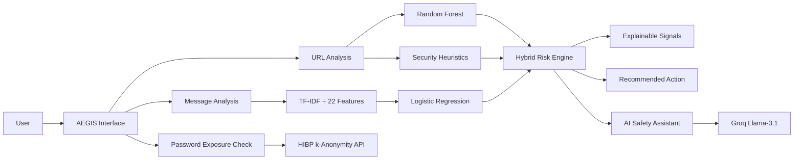
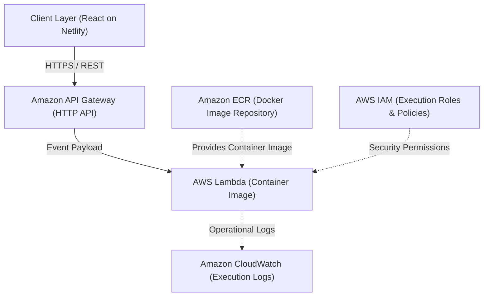
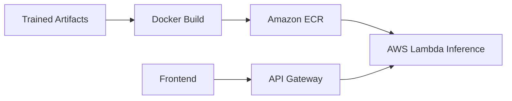

# AEGIS

An AI-powered personal digital safety assistant for detecting, explaining, and responding to everyday cyber threats.

**Detect → Explain → Protect → Act**

AEGIS empowers everyday users to analyze suspicious URLs, detect scam messages, verify credential exposure without sending passwords, identify possible brand impersonation, and receive grounded AI safety coaching alongside actionable reporting guidance.

---

## 1. Problem Statement

Everyday internet users face an escalating onslaught of phishing links, credential harvesting portals, SMS scams, urgent OTP traps, and deceptive brand impersonations. Most security tools are either enterprise-oriented or produce cryptic technical jargon. **AEGIS** bridges this gap by translating multi-signal cybersecurity analysis into plain, actionable guidance without requiring technical expertise.

## 2. Why AEGIS

- **Hybrid Detection**: Combines trained Machine Learning models with deterministic heuristic rule engines.
- **Explainable Signals**: Highlights *why* a link or message is suspicious rather than providing a black-box verdict.
- **Privacy-Preserving Audits**: Uses browser-side SHA-1 hashing and *k-anonymity* to audit passwords—plaintext credentials are never transmitted.
- **Actionable Escalation**: Contextually guides users to the official **National Cyber Crime Reporting Portal** and the **1930** financial fraud helpline.
- **Continuous Awareness**: Integrates **Cyber Sense**, a lightweight in-app habit builder that delivers real-world cybersecurity scenarios.

---

## 3. Key Features

- **URL Phishing Detection**: Evaluates raw URLs using 33 engineered structural/lexical features through a Random Forest classifier combined with deterministic security heuristics (IP hosts, punycode, URL shorteners, excessive subdomains, entropy).
- **Suspicious Message Detection**: Scans SMS and messages using TF-IDF vectorization and 22 extracted security pattern signals (urgency, credential solicitation, financial threats) via Logistic Regression.
- **Possible Impersonation Detection**: Identifies deceptive lookalike domains and message patterns imitating recognized banking, tech, and streaming services.
- **AI Safety Assistant (Nova)**: Powered by Groq (`llama-3.1-8b-instant`) to provide conversational, grounded explanations of detection results. *(Note: The AI assistant explains findings; primary threat classification is performed by the ML/heuristic engine).*
- **Password Exposure Check**: Queries Have I Been Pwned (HIBP) Pwned Passwords via *k-anonymity*. Passwords never leave the user's browser.
- **Digital Safety Score**: A dynamic 0–100 weighted indicator synthesized across URL risk (40%), message risk (30%), and credential exposure status (30%).
- **Cyber Sense**: A frontend-only habit check that presents real-world situations with 3 options and witty educational reactions. Rotates silently every randomized 2–3 minutes with zero gamification.
- **Reporting Guidance**: For high-risk threats (score $\ge 80$), provides direct referral guidance to India's official National Cyber Crime Reporting Portal (`cybercrime.gov.in`) and the 1930 helpline for financial fraud.

---

## 4. How AEGIS Works



---

## 5. AWS Architecture & Services

AEGIS uses a serverless, containerized AWS backend for its cybersecurity analysis APIs and ML inference, while the React frontend is hosted on Netlify.



### AWS / Infrastructure Breakdown

| Technology | Category | Role in AEGIS |
|---|---|---|
| **AWS Lambda** | Compute | Runs the containerized Python backend, ML model inference, risk scoring engines, and API integrations. |
| **Amazon API Gateway** | API Management | Exposes HTTPS endpoints with CORS configuration, routing frontend traffic to Lambda. |
| **Amazon ECR** | Container Registry | Stores the production Docker image containing the Python 3.12 runtime, dependencies, and trained model artifacts. |
| **Amazon CloudWatch** | Monitoring | Captures runtime stdout/stderr logs and latency metrics for operational diagnostics. |
| **AWS IAM** | Security | Grants least-privilege execution permissions for the Lambda function and API Gateway invocation. |
| **Docker** | Containerization | Packages the Python backend, scikit-learn, NumPy, pandas, and PKL artifacts into a reproducible Linux container image. |

> **AWS Highlight**: AWS powers the AEGIS backend: API Gateway provides the API entry point, Lambda executes the Python cybersecurity and ML workloads, ECR stores the Dockerized runtime, CloudWatch provides operational logs, and IAM manages AWS permissions.

### AWS Deployment Flow

```text
Backend Source Code ──> Docker Build ──> Docker Image ──> Amazon ECR ──> AWS Lambda ──> Amazon API Gateway ──> React Frontend on Netlify
```

### AWS + ML Deployment

AEGIS packages its Python ML runtime and trained model artifacts into a Docker container. The container image is stored in Amazon ECR and used by AWS Lambda for ML inference. Amazon API Gateway exposes the backend APIs to the React frontend.



---

## 6. Machine Learning Pipeline

- **URL Phishing Engine**:
  `Raw URL` → `Feature Extraction (33 features)` → `Random Forest Classifier` + `Heuristic Risk Signals` → `Hybrid Risk Engine (0-100)`
  *Features include*: URL length, subdomain depth, path depth, query parameter count, digit/letter ratios, Shannon entropy, IP address host, punycode/IDN markers, shortener domains, double slashes, and sensitive keyword buckets.
- **Message Phishing Engine**:
  `Raw Message` → `TF-IDF Matrix + 22 Pattern Features` → `Logistic Regression Classifier` → `Risk Assessment (0-100)`
  *Features include*: Urgency markers, credential keywords, financial solicitation words, OTP prompts, link counts, and capitalization ratios.

---

## 7. Dataset

- **Training Corpus**: [UCI PhiUSIIL Phishing URL Dataset](https://archive.ics.uci.edu/dataset/967/phiusiil+phishing+url+dataset) (UCI Dataset ID: 967).
- **Dataset Scale**: 235,795 instances comprising balanced legitimate and phishing URLs.
- **Methodology**: Extracted URL-level structural and lexical characteristics mapped into Scikit-Learn classifiers for lightweight serverless inference.

---

## 8. Security & Privacy Architecture

- **Zero-Knowledge Password Checks**:
  1. The user enters a password in the browser.
  2. The browser calculates the SHA-1 hash locally via the Web Crypto API.
  3. Only the 5-character hash prefix is sent to the backend/HIBP range API.
  4. Matching hash suffixes are compared locally on the server/client.
  *The plaintext password is never transmitted over the network or logged.*
- **Ephemeral Processing**: Scanned URLs and text messages are processed in-memory during Lambda invocation and are not stored in any database.

---

## 9. Risk & Response Engine

| Risk Level | Score Range | Primary Interpretation | User Guidance |
|---|---|---|---|
| **SAFE** | 0 – 19 | Minimal to no threat indicators detected | Safe to proceed with normal caution |
| **CAUTION** | 20 – 49 | Minor anomalies or unverified patterns detected | Inspect sender address and verify links |
| **SUSPICIOUS** | 50 – 79 | Multiple strong phishing or deceptive indicators | Do not enter credentials or approve payments |
| **CRITICAL** | 80 – 100 | Severe risk (e.g., lookalike domain, IP host, credential harvest) | Avoid completely; report to `cybercrime.gov.in` / call `1930` |

---

## 10. Tech Stack

- **Frontend**: React 18, TypeScript, Vite, Tailwind CSS, Framer Motion, Lucide React.
- **Backend**: Python 3.12, scikit-learn, NumPy, pandas, SciPy, joblib, requests, python-dotenv.
- **AI Engine**: Groq Cloud API (`llama-3.1-8b-instant`).
- **External Security Services**: Have I Been Pwned Pwned Passwords (*k-anonymity*).
- **Cloud & Deployment**: AWS Lambda (Container), Amazon API Gateway, Amazon ECR, Amazon CloudWatch, AWS IAM, Docker, Netlify.

---

## 11. Project Structure

```text
AEGIS/
├── backend/
│   ├── Dockerfile              # Lambda Python 3.12 container specification
│   ├── template.yaml           # AWS SAM infrastructure definition (API Gateway + Lambda)
│   ├── requirements.txt        # Python ML & runtime dependencies
│   ├── app.py                  # Local development server
│   ├── model_artifacts/        # Serialized Scikit-Learn PKL models & vectorizers
│   └── src/
│       ├── handler.py          # AWS Lambda event entrypoint
│       ├── router.py           # REST routing & sanitization
│       ├── models/             # URL & message threat detection engines
│       ├── services/           # Password check, scoring, and Groq services
│       └── utils/              # Impersonation rules & validators
├── frontend/
│   ├── index.html              # Entry HTML with typography tokens
│   ├── package.json            # Frontend dependency specifications
│   ├── vite.config.ts          # Vite build configuration
│   └── src/
│       ├── App.tsx             # Main dashboard layout
│       ├── components/         # UI components (CyberSense, ThreatResult, etc.)
│       ├── data/               # Cyber Sense curated question bank
│       └── api/client.ts       # Typed API client
├── docs/                       # Architectural design & deployment documentation
├── .gitignore                  # Environment, cache, and artifact exclusions
└── README.md                   # Project overview & documentation
```

---

## 12. Local Development

### Prerequisites
- Node.js 18+ & npm
- Python 3.11 or 3.12
- Groq API Key (for Nova AI Assistant)

### Backend Setup
```bash
cd backend
python -m venv venv
# Windows: .\venv\Scripts\activate | Unix: source venv/bin/activate
pip install -r requirements.txt
cp .env.example .env
# Set GROQ_API_KEY in .env
python app.py
```
*Local backend runs on `http://localhost:5000`.*

### Frontend Setup
```bash
cd frontend
npm install
npm run dev
```
*Frontend runs on `http://localhost:5173`.*

---

## 13. Demo Flow

1. **Launch**: Open the AEGIS dashboard on `http://localhost:5173`.
2. **URL Scan (Clean)**: Submit a known domain (e.g. `google.com`) → Verifies low risk and clean signals.
3. **URL Scan (Phishing)**: Submit an IP or lookalike URL → Inspects extracted risk signals and impersonation alerts.
4. **Message Scan**: Analyze an urgent banking SMS asking for an immediate OTP → Reviews flag breakdown.
5. **Password Audit**: Enter a common compromised password → Demonstrates privacy-preserving *k-anonymity* lookup.
6. **Digital Safety Score**: Observes the weighted score recalculation reflecting tested inputs.
7. **Ask Nova**: Query the AI Safety Assistant to receive an explanation of why a specific flag was triggered.
8. **Cyber Sense**: Answer an interactive scenario to receive immediate witty + educational feedback.
9. **Reporting Action**: For high-risk results, review the direct escalation link to `cybercrime.gov.in`.

---

## 14. Hackathon Value

- **Practical & Relatable**: Solves real digital defense challenges for non-technical users.
- **Architectural Excellence**: True serverless container execution on AWS Lambda with automated API Gateway routing and zero idle compute costs.
- **Explainability**: Prioritizes transparent reasoning over black-box scores.
- **Privacy by Design**: Cryptographic *k-anonymity* ensures user passwords remain strictly client-side.

---

## 15. Attribution & External Resources

- **Dataset**: [UCI PhiUSIIL Phishing URL Dataset](https://archive.ics.uci.edu/dataset/967/phiusiil+phishing+url+dataset) — UCI Machine Learning Repository (ID: 967).
- **Breach API**: [Have I Been Pwned Pwned Passwords](https://haveibeenpwned.com/API/v3#PwnedPasswords) by Troy Hunt.
- **LLM Inference**: [Groq Cloud](https://groq.com) Llama-3.1 API.
- **Reporting Resources**: [Indian National Cyber Crime Reporting Portal](https://www.cybercrime.gov.in/) & [Report Suspect Portal](https://www.cybercrime.gov.in/Webform/cyber_suspect.aspx).
