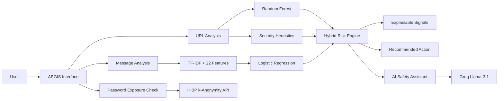
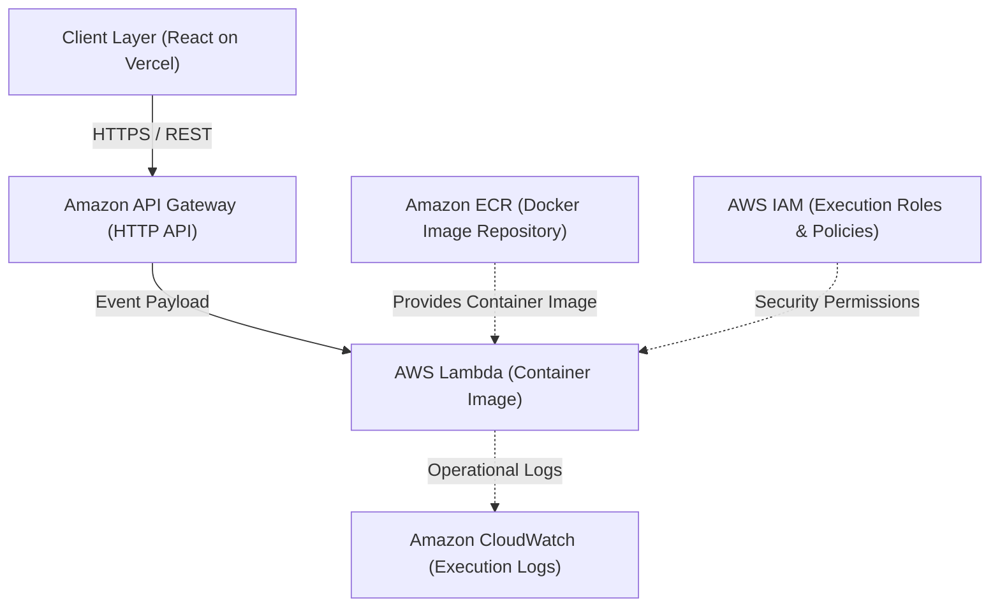
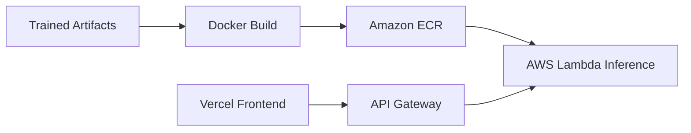

# AEGIS

An AI-powered personal digital safety assistant for detecting, explaining, and responding to everyday cyber threats.

**Detect → Explain → Protect → Act**

### Live Demo
https://aegis-liard-kappa.vercel.app/

### GitHub
https://github.com/sandeep0431/AEGIS

---

## Problem Statement

Everyday internet users face an escalating onslaught of phishing links, credential harvesting portals, SMS scams, urgent OTP traps, and deceptive brand impersonations. Most cybersecurity solutions target enterprise IT environments or present technical diagnostic metrics that confuse non-technical users. **AEGIS** bridges this gap by translating multi-signal threat detection into plain-language explanations, privacy-preserving checks, and actionable safety guidance.

---

## Target Users & Expected Impact

* **Target Users**: Students, non-technical internet users, and anyone seeking to evaluate suspicious links, messages, or exposed passwords.
* **Expected Impact**:
  * Empowers users to identify suspicious digital content before falling victim to fraud.
  * Explains *why* specific content is risky using transparent signal breakdowns.
  * Provides actionable safety steps and direct official reporting referral pathways.
  * Promotes digital threat awareness through interactive micro-learning scenarios.

---

## Why AEGIS

* **Hybrid Detection**: Combines trained Machine Learning models with deterministic security rule engines.
* **Explainable Signals**: Demystifies verdicts by highlighting explicit URL and text indicators (e.g., punycode, IP host, urgency patterns).
* **Privacy-Preserving Audits**: Evaluates password exposure using browser-side SHA-1 hashing and *k-anonymity*—plaintext credentials are never transmitted.
* **Possible Impersonation Flags**: Detects lookalike domains and brand deception patterns.
* **Grounded AI Safety Assistant**: Delivers conversational context via Groq LLM without relying on AI for primary threat classification.
* **Cyber Sense Awareness**: Includes an in-app scenario module to build cybersecurity intuition.
* **Contextual Escalation**: Directs high-risk cases to official reporting channels (such as India's National Cyber Crime Reporting Portal and 1930 helpline).

---

## Key Features

* **URL Phishing Detection**: Analyzes raw URLs using 33 engineered structural/lexical features via a Random Forest model paired with deterministic security heuristics (IP hosts, HTTPS status, punycode, shorteners, excessive subdomains, entropy).
* **Suspicious Message Detection**: Scans SMS/messages using TF-IDF vectorization and 22 extracted pattern signals (urgency, credential requests, financial threats, OTP prompts) through Logistic Regression.
* **Possible Impersonation Detection**: Identifies potential lookalike domains imitating popular tech, banking, and digital services.
* **AI Safety Assistant (Nova)**: Powered by Groq (`llama-3.1-8b-instant`) to answer user queries and explain structured scan results. *(Primary classification is performed by ML/heuristics).*
* **Password Exposure Check**: Audits password compromise via Have I Been Pwned Pwned Passwords using browser-side SHA-1 *k-anonymity* (5-character hash prefix).
* **Digital Safety Score**: A dynamic 0–100 weighted posture indicator: URL Safety (40%), Message Safety (30%), and Credential Exposure (30%). Higher score = safer state.
* **Cyber Sense**: Frontend micro-learning module presenting real-world scenarios with 3 options and educational feedback.
* **Reporting Guidance**: For high-risk threats (risk score $\ge 76$), provides direct guidance to the National Cyber Crime Reporting Portal (`cybercrime.gov.in`) and the 1930 financial fraud helpline.

---

## How AEGIS Works



---

## AWS Architecture & Services

AEGIS uses a serverless, containerized AWS backend for cybersecurity analysis APIs and ML inference, while the React/Vite frontend is hosted on Vercel.



### AWS / Infrastructure Breakdown

| Technology | Category | Role in AEGIS |
|---|---|---|
| **AWS Lambda** | Compute | Executes containerized Python backend, ML inference, risk scoring, and API route handlers. |
| **Amazon API Gateway** | API Management | Exposes CORS-enabled HTTPS REST endpoints and routes frontend traffic to AWS Lambda. |
| **Amazon ECR** | Container Registry | Stores the backend Docker container image containing Python runtime, libraries, and ML PKL models. |
| **Amazon CloudWatch** | Monitoring | Logs execution stdout/stderr and monitors Lambda invocation metrics. |
| **AWS IAM** | Security | Manages execution roles and access policies for AWS Lambda and API Gateway. |
| **Docker** | Containerization | Packages the Python backend, scikit-learn, NumPy, pandas, and trained artifacts into a Linux container image. |

### AWS Deployment Flow



`Backend Source Code` → `Docker Build` → `Amazon ECR` → `AWS Lambda` → `Amazon API Gateway` → `Vercel React Frontend`

---

## Machine Learning Pipeline

* **URL Phishing Engine**:
  `Raw URL` → `Feature Extraction (33 features)` → `Random Forest Classifier` + `Heuristic Risk Signals` → `Hybrid Risk Score (0-100)`  
  *Extracted features include*: Subdomain count, URL length, entropy, IP address host, punycode/IDN flags, shortener domains, double slashes, and sensitive keyword buckets.
* **Message Detection Engine**:
  `Raw Message` → `TF-IDF Matrix + 22 Pattern Features` → `Logistic Regression Classifier` → `Risk Assessment (0-100)`  
  *Extracted features include*: Urgency markers, credential keywords, financial solicitation terms, OTP prompts, link counts, and capitalization ratios.

---

## Dataset

* **Training Corpus**: [UCI PhiUSIIL Phishing URL Dataset](https://archive.ics.uci.edu/dataset/967/phiusiil+phishing+url+dataset) (UCI Dataset ID: 967).
* **Dataset Scale**: 235,795 instances of balanced legitimate and phishing URLs.
* **Methodology**: Extracted URL-level structural and lexical features mapped into Scikit-Learn models for lightweight serverless execution.

---

## Security & Privacy Architecture

* **Privacy-Preserving Password Checks**:
  1. Password entered in the browser.
  2. Browser computes SHA-1 hash via Web Crypto API (with pure JS fallback).
  3. Only the 5-character hash prefix is sent to the HIBP Pwned Passwords range API (*k-anonymity*).
  4. Full hash suffix matching occurs on the returned prefix list. Plaintext passwords are **never** transmitted.
* **Ephemeral Data Processing**: Scanned URLs and text messages are processed in-memory during Lambda invocation and are not stored in any database.
* **Configuration Safety**: Environment variables are managed via `.env` files; `.env.example` is provided without hardcoded secrets.

---

## Risk & Response Engine

| Risk Level | Score Range | Primary Interpretation | Recommended Guidance |
|---|---|---|---|
| **SAFE** | 0 – 19 | Minimal to no threat indicators detected | Safe to proceed with normal caution |
| **CAUTION** | 20 – 49 | Minor anomalies or unverified patterns detected | Inspect sender address and verify links |
| **SUSPICIOUS** | 50 – 75 | Multiple strong phishing or deceptive indicators | Avoid entering credentials or clicking links |
| **CRITICAL** | 76 – 100 | Severe risk (e.g., lookalike domain, IP host, credential harvest) | Avoid completely; review reporting guidance (`cybercrime.gov.in` / `1930`) |

---

## Technology Stack

* **Frontend**: React 18, TypeScript, Vite, Tailwind CSS, Framer Motion, Lucide React.
* **Backend**: Python 3.12, scikit-learn, NumPy, pandas, SciPy, joblib, requests, python-dotenv.
* **AI Engine**: Groq Cloud API (`llama-3.1-8b-instant`).
* **External Security Services**: Have I Been Pwned Pwned Passwords (*k-anonymity*).
* **Cloud & Hosting**: Vercel (Frontend), AWS Lambda, Amazon API Gateway, Amazon ECR, Amazon CloudWatch, AWS IAM, Docker.

---

## Project Structure

```text
AEGIS/
├── backend/
│   ├── Dockerfile              # Python 3.12 Lambda container spec
│   ├── template.yaml           # AWS SAM infrastructure definition
│   ├── requirements.txt        # Backend dependencies
│   ├── app.py                  # Local Flask/dev server
│   ├── model_artifacts/        # Serialized PKL models & vectorizers
│   └── src/
│       ├── handler.py          # AWS Lambda event handler
│       ├── router.py           # REST routing & input handling
│       ├── models/             # URL & message threat detection engines
│       ├── services/           # Password check, scoring, and Groq services
│       └── utils/              # Impersonation rules & validators
├── frontend/
│   ├── index.html              # HTML entry point
│   ├── package.json            # Frontend dependency specifications
│   ├── vite.config.ts          # Vite build config
│   └── src/
│       ├── App.tsx             # Main dashboard application
│       ├── components/         # UI components (CyberSense, ThreatResult, etc.)
│       ├── data/               # Cyber Sense scenario bank
│       └── api/client.ts       # Typed REST client
├── docs/                       # Project documentation
├── .gitignore                  # Exclusion rules
└── README.md                   # Project overview & documentation
```

---

## Local Development

### Prerequisites
* Node.js 18+ & npm
* Python 3.11 or 3.12
* Groq API Key (for Nova AI Assistant)

### Backend Setup
```bash
cd backend
python -m venv venv
# Windows: .\venv\Scripts\activate | Unix: source venv/bin/activate
pip install -r requirements.txt
cp .env.example .env
# Set GROQ_API_KEY in .env
python app.py
```
*Backend runs locally on `http://localhost:5000`.*

### Frontend Setup
```bash
cd frontend
npm install
npm run dev
```
*Frontend runs locally on `http://localhost:5173`.*

---

## Production Deployment

* **Frontend**: Deployed on **Vercel** with continuous deployment from GitHub. Communicates with AWS via `VITE_API_BASE_URL`.
* **Backend**: Docker image containing Python runtime and ML artifacts built and pushed to **Amazon ECR**, served via **AWS Lambda** behind **Amazon API Gateway**.
* **Live Web App**: [https://aegis-liard-kappa.vercel.app/](https://aegis-liard-kappa.vercel.app/)

---

## Live Demo Walkthrough

1. **Launch**: Open [https://aegis-liard-kappa.vercel.app/](https://aegis-liard-kappa.vercel.app/).
2. **Safe URL Scan**: Analyze a trusted domain (e.g. `google.com`) → Verifies low risk and clean signals.
3. **Phishing URL Scan**: Analyze an IP host or lookalike domain → Reviews extracted risk signals and impersonation flags.
4. **Message Scan**: Analyze an urgent SMS requesting an OTP → Reviews feature breakdown and risk assessment.
5. **Password Exposure Check**: Enter a test credential → Demonstrates privacy-preserving *k-anonymity* lookup.
6. **Digital Safety Score**: Views the weighted 0–100 posture score.
7. **Ask Nova**: Interactively query the AI assistant to explain detection signals.
8. **Cyber Sense**: Complete a micro-learning scenario to build cybersecurity awareness.
9. **Reporting Action**: For high-risk outputs ($\ge 76$), inspect reporting referral details to `cybercrime.gov.in` and `1930`.

---

## Innovation & Hackathon Value

* **User-Centric Security Workflow**: Combines **Detect → Explain → Protect → Act** into an accessible interface for everyday users.
* **Explainability over Black-Box Scoring**: Explains threat logic via extracted ML/heuristic signals rather than raw opaque verdicts.
* **Privacy-First Engineering**: Browser-side SHA-1 + *k-anonymity* ensures user passwords remain strictly client-side.
* **Serverless Container Architecture**: Zero idle compute cost using AWS Lambda, Amazon API Gateway, and Amazon ECR container deployment.

---

## Limitations

* **Model Dependencies**: ML detection accuracy relies on feature extraction patterns and training dataset distribution.
* **Impersonation Scope**: Brand impersonation detection uses domain heuristics and lookalike rules rather than formal cryptographic identity verification.
* **AI Assistant Boundary**: The AI assistant provides explanations based on structured findings; primary threat classification is performed by ML/heuristics.
* **Coverage**: Password audit checks rely on Have I Been Pwned public breach records.

---

## Future Scope

* Integration of real-time threat intelligence feeds.
* Browser extension for active web browsing inspection.
* Support for multilingual scam message detection and AI explanations.
* Expanded Cyber Sense scenario libraries and downloadable threat summaries.

---

## Attribution & External Resources

* **Dataset**: [UCI PhiUSIIL Phishing URL Dataset](https://archive.ics.uci.edu/dataset/967/phiusiil+phishing+url+dataset) — UCI Machine Learning Repository (ID: 967).
* **Password Exposure API**: [Have I Been Pwned Pwned Passwords](https://haveibeenpwned.com/API/v3#PwnedPasswords) by Troy Hunt.
* **LLM Inference**: [Groq Cloud API](https://groq.com) (`llama-3.1-8b-instant`).
* **Reporting Resources**: [Indian National Cyber Crime Reporting Portal](https://www.cybercrime.gov.in/).

---

## Hackathon Submission Checklist

* [x] Problem statement identified
* [x] Target users and expected impact documented
* [x] Solution explained
* [x] Method and architecture documented
* [x] Major features documented
* [x] Technology stack listed
* [x] AWS technologies and their roles documented
* [x] Innovation/key features explained
* [x] Limitations documented
* [x] Future scope documented
* [x] GitHub repository available
* [x] Live demo available
* [x] Setup instructions provided
* [x] `.env.example` provided
* [x] No secrets included
* [x] External datasets/APIs/services acknowledged
